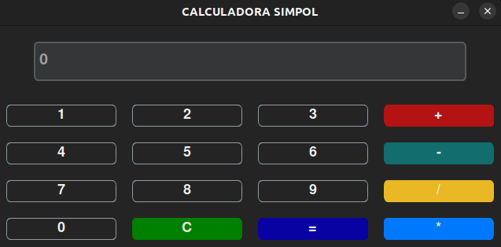

# Calculadora Simples



Uma calculadora simples implementada em Python usando a biblioteca customtkinter.

## Funcionalidades

- Adição
- Subtração
- Multiplicação
- Divisão

## Como Usar

1. Clone este repositório:

    ```bash
    git clone https://github.com/JoaoPauloRomualdo/Calculadora.git
    cd Calculadora
    ```

2. Instale as dependências:

    ```bash
    pip install -r requirements.txt
    ```

3. Execute o aplicativo:

    ```bash
    python main.py
    ```

## Personalização

Você pode ajustar a aparência da calculadora modificando as configurações no arquivo `main.py`. Sinta-se à vontade para explorar e adaptar conforme suas necessidades.

## Contribuições

Contribuições são bem-vindas! Se você encontrar problemas ou tiver ideias para melhorar a calculadora, abra uma [issue](https://github.com/JoaoPauloRomualdo/Calculadora/issues) ou envie um pull request.

## Licença

Este projeto é licenciado sob a Licença MIT - consulte o arquivo [LICENSE](LICENSE) para obter detalhes.
